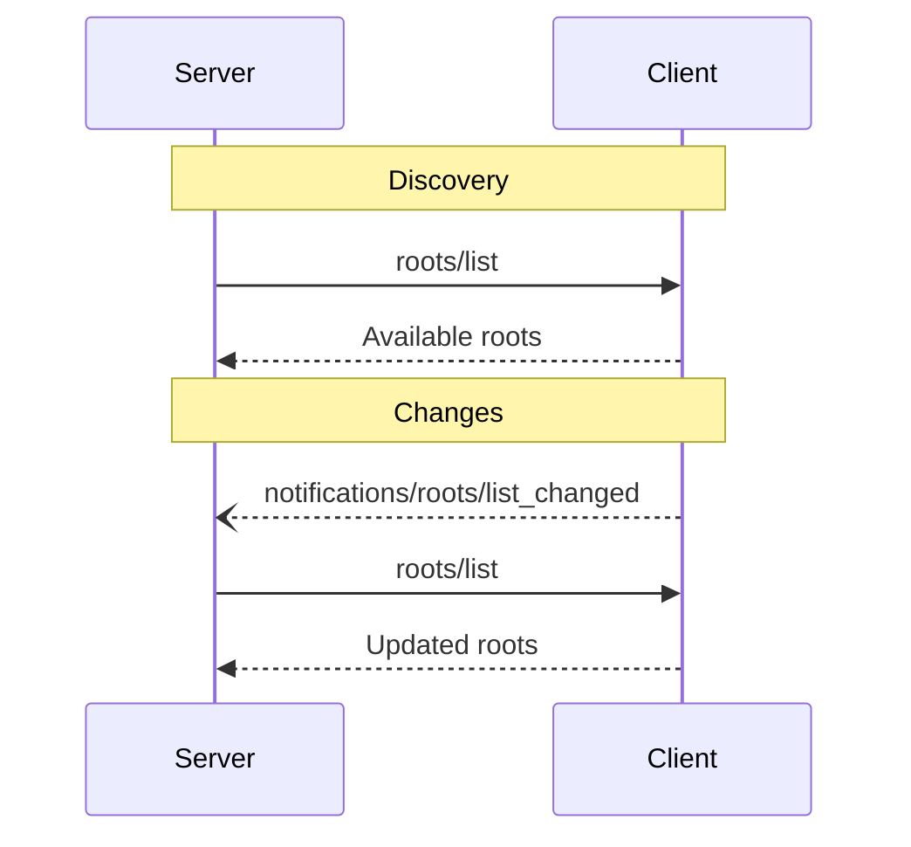
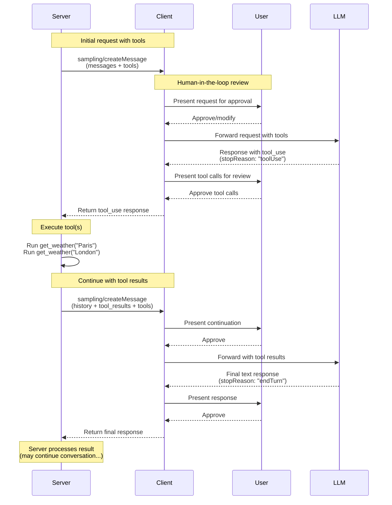
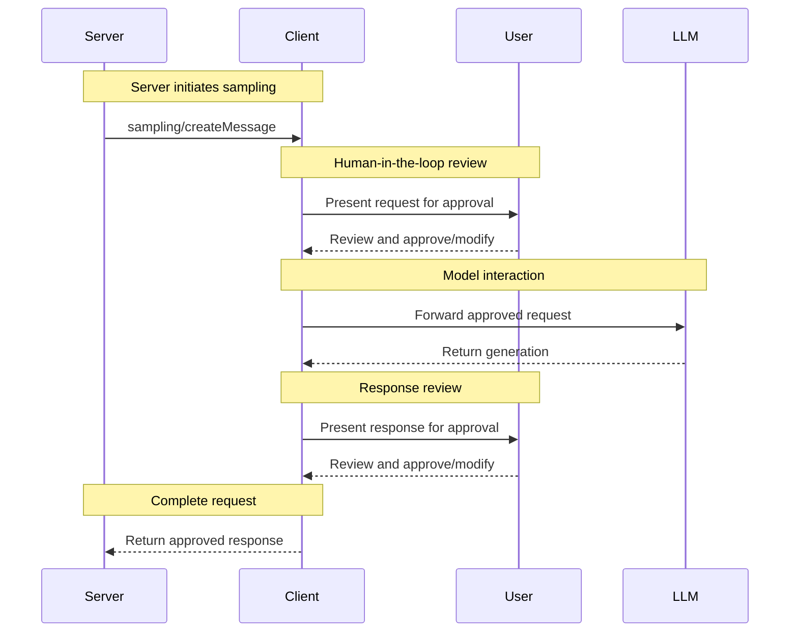
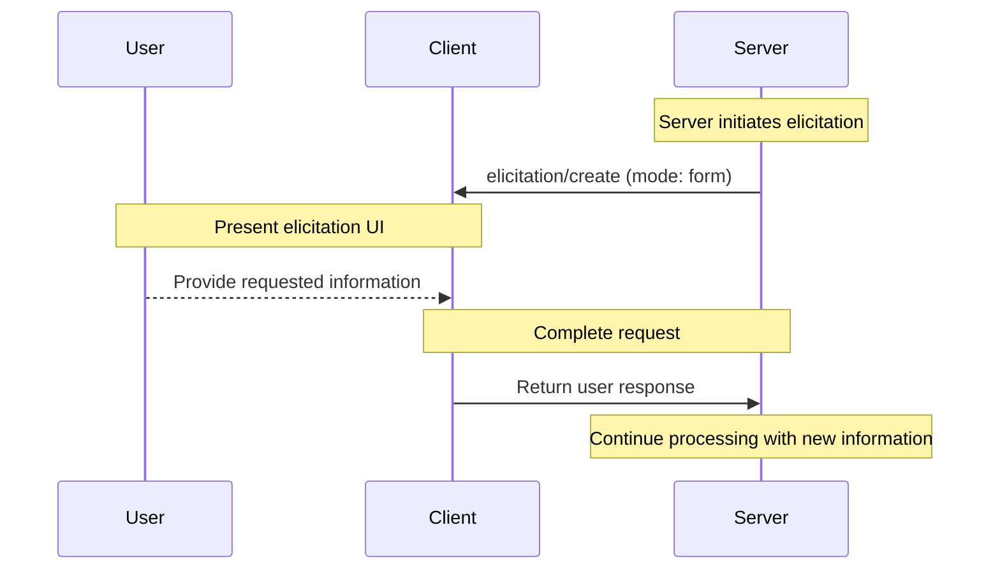
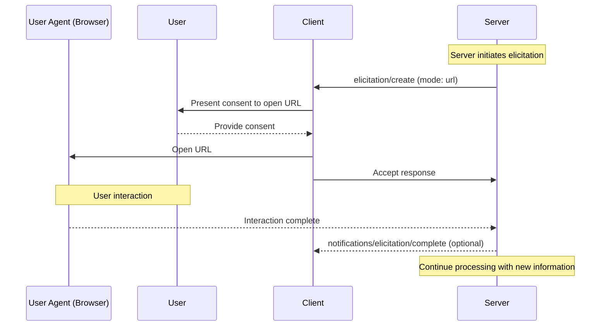
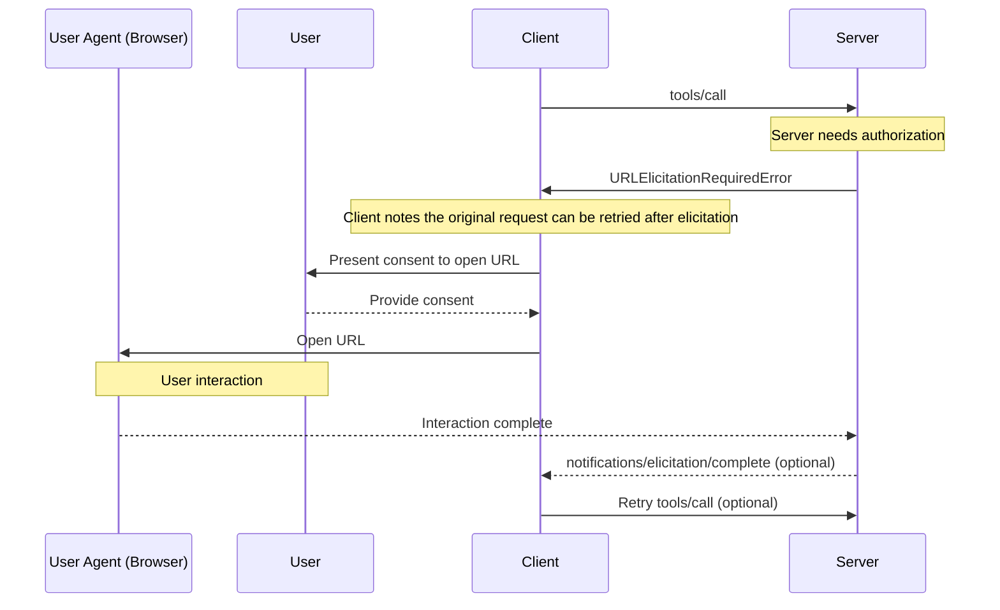
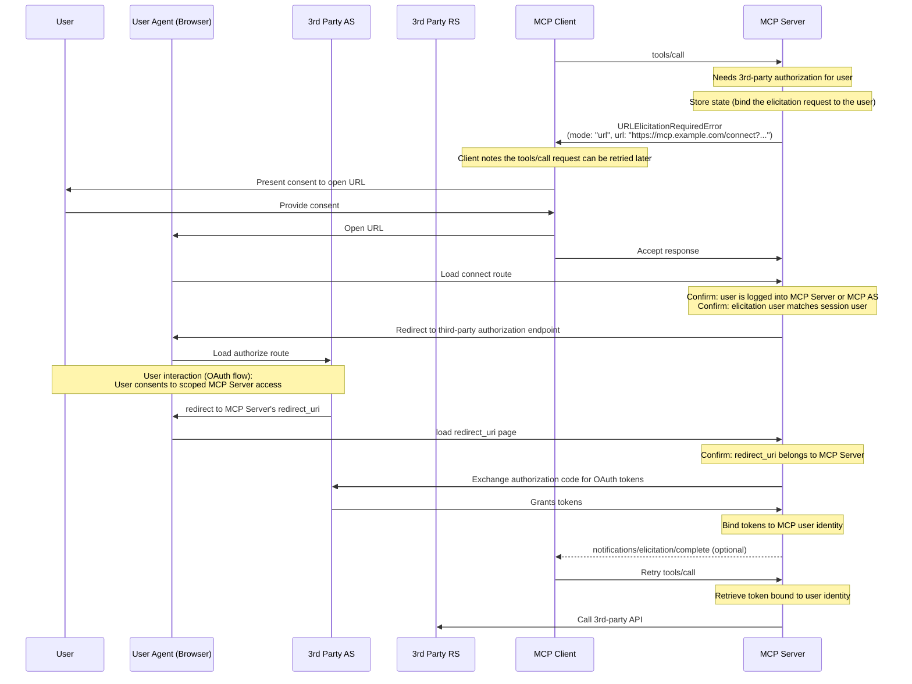

# Roots

<div id="enable-section-numbers" />

<Info>**Protocol Revision**: 2025-11-25</Info>

The Model Context Protocol (MCP) provides a standardized way for clients to expose
filesystem "roots" to servers. Roots define the boundaries of where servers can operate
within the filesystem, allowing them to understand which directories and files they have
access to. Servers can request the list of roots from supporting clients and receive
notifications when that list changes.

## User Interaction Model

Roots in MCP are typically exposed through workspace or project configuration interfaces.

For example, implementations could offer a workspace/project picker that allows users to
select directories and files the server should have access to. This can be combined with
automatic workspace detection from version control systems or project files.

However, implementations are free to expose roots through any interface pattern that
suits their needs—the protocol itself does not mandate any specific user
interaction model.

## Capabilities

Clients that support roots **MUST** declare the `roots` capability during
[initialization](/specification/2025-11-25/basic/lifecycle#initialization):

```json  theme={null}
{
  "capabilities": {
    "roots": {
      "listChanged": true
    }
  }
}
```

`listChanged` indicates whether the client will emit notifications when the list of roots
changes.

## Protocol Messages

### Listing Roots

To retrieve roots, servers send a `roots/list` request:

**Request:**

```json  theme={null}
{
  "jsonrpc": "2.0",
  "id": 1,
  "method": "roots/list"
}
```

**Response:**

```json  theme={null}
{
  "jsonrpc": "2.0",
  "id": 1,
  "result": {
    "roots": [
      {
        "uri": "file:///home/user/projects/myproject",
        "name": "My Project"
      }
    ]
  }
}
```

### Root List Changes

When roots change, clients that support `listChanged` **MUST** send a notification:

```json  theme={null}
{
  "jsonrpc": "2.0",
  "method": "notifications/roots/list_changed"
}
```

## Message Flow



## Data Types

### Root

A root definition includes:

* `uri`: Unique identifier for the root. This **MUST** be a `file://` URI in the current
  specification.
* `name`: Optional human-readable name for display purposes.

Example roots for different use cases:

#### Project Directory

```json  theme={null}
{
  "uri": "file:///home/user/projects/myproject",
  "name": "My Project"
}
```

#### Multiple Repositories

```json  theme={null}
[
  {
    "uri": "file:///home/user/repos/frontend",
    "name": "Frontend Repository"
  },
  {
    "uri": "file:///home/user/repos/backend",
    "name": "Backend Repository"
  }
]
```

## Error Handling

Clients **SHOULD** return standard JSON-RPC errors for common failure cases:

* Client does not support roots: `-32601` (Method not found)
* Internal errors: `-32603`

Example error:

```json  theme={null}
{
  "jsonrpc": "2.0",
  "id": 1,
  "error": {
    "code": -32601,
    "message": "Roots not supported",
    "data": {
      "reason": "Client does not have roots capability"
    }
  }
}
```

## Security Considerations

1. Clients **MUST**:
    * Only expose roots with appropriate permissions
    * Validate all root URIs to prevent path traversal
    * Implement proper access controls
    * Monitor root accessibility

2. Servers **SHOULD**:
    * Handle cases where roots become unavailable
    * Respect root boundaries during operations
    * Validate all paths against provided roots

## Implementation Guidelines

1. Clients **SHOULD**:
    * Prompt users for consent before exposing roots to servers
    * Provide clear user interfaces for root management
    * Validate root accessibility before exposing
    * Monitor for root changes

2. Servers **SHOULD**:
    * Check for roots capability before usage
    * Handle root list changes gracefully
    * Respect root boundaries in operations
    * Cache root information appropriately


---

# Sampling

<div id="enable-section-numbers" />

<Info>**Protocol Revision**: 2025-11-25</Info>

The Model Context Protocol (MCP) provides a standardized way for servers to request LLM
sampling ("completions" or "generations") from language models via clients. This flow
allows clients to maintain control over model access, selection, and permissions while
enabling servers to leverage AI capabilities—with no server API keys necessary.
Servers can request text, audio, or image-based interactions and optionally include
context from MCP servers in their prompts.

## User Interaction Model

Sampling in MCP allows servers to implement agentic behaviors, by enabling LLM calls to
occur *nested* inside other MCP server features.

Implementations are free to expose sampling through any interface pattern that suits
their needs—the protocol itself does not mandate any specific user interaction
model.

<Warning>
  For trust & safety and security, there **SHOULD** always
  be a human in the loop with the ability to deny sampling requests.

Applications **SHOULD**:

* Provide UI that makes it easy and intuitive to review sampling requests
* Allow users to view and edit prompts before sending
* Present generated responses for review before delivery
  </Warning>

## Tools in Sampling

Servers can request that the client's LLM use tools during sampling by providing a `tools` array and optional `toolChoice` configuration in their sampling requests. This enables servers to implement agentic behaviors where the LLM can call tools, receive results, and continue the conversation - all within a single sampling request flow.

Clients **MUST** declare support for tool use via the `sampling.tools` capability to receive tool-enabled sampling requests. Servers **MUST NOT** send tool-enabled sampling requests to Clients that have not declared support for tool use via the `sampling.tools` capability.

## Capabilities

Clients that support sampling **MUST** declare the `sampling` capability during
[initialization](/specification/2025-11-25/basic/lifecycle#initialization):

**Basic sampling:**

```json  theme={null}
{
  "capabilities": {
    "sampling": {}
  }
}
```

**With tool use support:**

```json  theme={null}
{
  "capabilities": {
    "sampling": {
      "tools": {}
    }
  }
}
```

**With context inclusion support (soft-deprecated):**

```json  theme={null}
{
  "capabilities": {
    "sampling": {
      "context": {}
    }
  }
}
```

<Note>
  The `includeContext` parameter values `"thisServer"` and `"allServers"` are
  soft-deprecated. Servers **SHOULD** avoid using these values (e.g. can just
  omit `includeContext` since it defaults to `"none"`), and **SHOULD NOT** use
  them unless the client declares `sampling.context` capability. These values
  may be removed in future spec releases.
</Note>

## Protocol Messages

### Creating Messages

To request a language model generation, servers send a `sampling/createMessage` request:

**Request:**

```json  theme={null}
{
  "jsonrpc": "2.0",
  "id": 1,
  "method": "sampling/createMessage",
  "params": {
    "messages": [
      {
        "role": "user",
        "content": {
          "type": "text",
          "text": "What is the capital of France?"
        }
      }
    ],
    "modelPreferences": {
      "hints": [
        {
          "name": "claude-3-sonnet"
        }
      ],
      "intelligencePriority": 0.8,
      "speedPriority": 0.5
    },
    "systemPrompt": "You are a helpful assistant.",
    "maxTokens": 100
  }
}
```

**Response:**

```json  theme={null}
{
  "jsonrpc": "2.0",
  "id": 1,
  "result": {
    "role": "assistant",
    "content": {
      "type": "text",
      "text": "The capital of France is Paris."
    },
    "model": "claude-3-sonnet-20240307",
    "stopReason": "endTurn"
  }
}
```

### Sampling with Tools

The following diagram illustrates the complete flow of sampling with tools, including the multi-turn tool loop:



To request LLM generation with tool use capabilities, servers include `tools` and optionally `toolChoice` in the request:

**Request (Server -> Client):**

```json  theme={null}
{
  "jsonrpc": "2.0",
  "id": 1,
  "method": "sampling/createMessage",
  "params": {
    "messages": [
      {
        "role": "user",
        "content": {
          "type": "text",
          "text": "What's the weather like in Paris and London?"
        }
      }
    ],
    "tools": [
      {
        "name": "get_weather",
        "description": "Get current weather for a city",
        "inputSchema": {
          "type": "object",
          "properties": {
            "city": {
              "type": "string",
              "description": "City name"
            }
          },
          "required": ["city"]
        }
      }
    ],
    "toolChoice": {
      "mode": "auto"
    },
    "maxTokens": 1000
  }
}
```

**Response (Client -> Server):**

```json  theme={null}
{
  "jsonrpc": "2.0",
  "id": 1,
  "result": {
    "role": "assistant",
    "content": [
      {
        "type": "tool_use",
        "id": "call_abc123",
        "name": "get_weather",
        "input": {
          "city": "Paris"
        }
      },
      {
        "type": "tool_use",
        "id": "call_def456",
        "name": "get_weather",
        "input": {
          "city": "London"
        }
      }
    ],
    "model": "claude-3-sonnet-20240307",
    "stopReason": "toolUse"
  }
}
```

### Multi-turn Tool Loop

After receiving tool use requests from the LLM, the server typically:

1. Executes the requested tool uses.
2. Sends a new sampling request with the tool results appended
3. Receives the LLM's response (which might contain new tool uses)
4. Repeats as many times as needed (server might cap the maximum number of iterations, and e.g. pass `toolChoice: {mode: "none"}` on the last iteration to force a final result)

**Follow-up request (Server -> Client) with tool results:**

```json  theme={null}
{
  "jsonrpc": "2.0",
  "id": 2,
  "method": "sampling/createMessage",
  "params": {
    "messages": [
      {
        "role": "user",
        "content": {
          "type": "text",
          "text": "What's the weather like in Paris and London?"
        }
      },
      {
        "role": "assistant",
        "content": [
          {
            "type": "tool_use",
            "id": "call_abc123",
            "name": "get_weather",
            "input": { "city": "Paris" }
          },
          {
            "type": "tool_use",
            "id": "call_def456",
            "name": "get_weather",
            "input": { "city": "London" }
          }
        ]
      },
      {
        "role": "user",
        "content": [
          {
            "type": "tool_result",
            "toolUseId": "call_abc123",
            "content": [
              {
                "type": "text",
                "text": "Weather in Paris: 18°C, partly cloudy"
              }
            ]
          },
          {
            "type": "tool_result",
            "toolUseId": "call_def456",
            "content": [
              {
                "type": "text",
                "text": "Weather in London: 15°C, rainy"
              }
            ]
          }
        ]
      }
    ],
    "tools": [
      {
        "name": "get_weather",
        "description": "Get current weather for a city",
        "inputSchema": {
          "type": "object",
          "properties": {
            "city": { "type": "string" }
          },
          "required": ["city"]
        }
      }
    ],
    "maxTokens": 1000
  }
}
```

**Final response (Client -> Server):**

```json  theme={null}
{
  "jsonrpc": "2.0",
  "id": 2,
  "result": {
    "role": "assistant",
    "content": {
      "type": "text",
      "text": "Based on the current weather data:\n\n- **Paris**: 18°C and partly cloudy - quite pleasant!\n- **London**: 15°C and rainy - you'll want an umbrella.\n\nParis has slightly warmer and drier conditions today."
    },
    "model": "claude-3-sonnet-20240307",
    "stopReason": "endTurn"
  }
}
```

## Message Content Constraints

### Tool Result Messages

When a user message contains tool results (type: "tool\_result"), it **MUST** contain ONLY tool results. Mixing tool results with other content types (text, image, audio) in the same message is not allowed.

This constraint ensures compatibility with provider APIs that use dedicated roles for tool results (e.g., OpenAI's "tool" role, Gemini's "function" role).

**Valid - single tool result:**

```json  theme={null}
{
  "role": "user",
  "content": {
    "type": "tool_result",
    "toolUseId": "call_123",
    "content": [{ "type": "text", "text": "Result data" }]
  }
}
```

**Valid - multiple tool results:**

```json  theme={null}
{
  "role": "user",
  "content": [
    {
      "type": "tool_result",
      "toolUseId": "call_123",
      "content": [{ "type": "text", "text": "Result 1" }]
    },
    {
      "type": "tool_result",
      "toolUseId": "call_456",
      "content": [{ "type": "text", "text": "Result 2" }]
    }
  ]
}
```

**Invalid - mixed content:**

```json  theme={null}
{
  "role": "user",
  "content": [
    {
      "type": "text",
      "text": "Here are the results:"
    },
    {
      "type": "tool_result",
      "toolUseId": "call_123",
      "content": [{ "type": "text", "text": "Result data" }]
    }
  ]
}
```

### Tool Use and Result Balance

When using tool use in sampling, every assistant message containing `ToolUseContent` blocks **MUST** be followed by a user message that consists entirely of `ToolResultContent` blocks, with each tool use (e.g. with `id: $id`) matched by a corresponding tool result (with `toolUseId: $id`), before any other message.

This requirement ensures:

* Tool uses are always resolved before the conversation continues
* Provider APIs can concurrently process multiple tool uses and fetch their results in parallel
* The conversation maintains a consistent request-response pattern

**Example valid sequence:**

1. User message: "What's the weather like in Paris and London?"
2. Assistant message: `ToolUseContent` (`id: "call_abc123", name: "get_weather", input: {city: "Paris"}`) + `ToolUseContent` (`id: "call_def456", name: "get_weather", input: {city: "London"}`)
3. User message: `ToolResultContent` (`toolUseId: "call_abc123", content: "18°C, partly cloudy"`) + `ToolResultContent` (`toolUseId: "call_def456", content: "15°C, rainy"`)
4. Assistant message: Text response comparing the weather in both cities

**Invalid sequence - missing tool result:**

1. User message: "What's the weather like in Paris and London?"
2. Assistant message: `ToolUseContent` (`id: "call_abc123", name: "get_weather", input: {city: "Paris"}`) + `ToolUseContent` (`id: "call_def456", name: "get_weather", input: {city: "London"}`)
3. User message: `ToolResultContent` (`toolUseId: "call_abc123", content: "18°C, partly cloudy"`) ← Missing result for call\_def456
4. Assistant message: Text response (invalid - not all tool uses were resolved)

## Cross-API Compatibility

The sampling specification is designed to work across multiple LLM provider APIs (Claude, OpenAI, Gemini, etc.). Key design decisions for compatibility:

### Message Roles

MCP uses two roles: "user" and "assistant".

Tool use requests are sent in CreateMessageResult with the "assistant" role.
Tool results are sent back in messages with the "user" role.
Messages with tool results cannot contain other kinds of content.

### Tool Choice Modes

`CreateMessageRequest.params.toolChoice` controls the tool use ability of the model:

* `{mode: "auto"}`: Model decides whether to use tools (default)
* `{mode: "required"}`: Model MUST use at least one tool before completing
* `{mode: "none"}`: Model MUST NOT use any tools

### Parallel Tool Use

MCP allows models to make multiple tool use requests in parallel (returning an array of `ToolUseContent`). All major provider APIs support this:

* **Claude**: Supports parallel tool use natively
* **OpenAI**: Supports parallel tool calls (can be disabled with `parallel_tool_calls: false`)
* **Gemini**: Supports parallel function calls natively

Implementations wrapping providers that support disabling parallel tool use MAY expose this as an extension, but it is not part of the core MCP specification.

## Message Flow



## Data Types

### Messages

Sampling messages can contain:

#### Text Content

```json  theme={null}
{
  "type": "text",
  "text": "The message content"
}
```

#### Image Content

```json  theme={null}
{
  "type": "image",
  "data": "base64-encoded-image-data",
  "mimeType": "image/jpeg"
}
```

#### Audio Content

```json  theme={null}
{
  "type": "audio",
  "data": "base64-encoded-audio-data",
  "mimeType": "audio/wav"
}
```

### Model Preferences

Model selection in MCP requires careful abstraction since servers and clients may use
different AI providers with distinct model offerings. A server cannot simply request a
specific model by name since the client may not have access to that exact model or may
prefer to use a different provider's equivalent model.

To solve this, MCP implements a preference system that combines abstract capability
priorities with optional model hints:

#### Capability Priorities

Servers express their needs through three normalized priority values (0-1):

* `costPriority`: How important is minimizing costs? Higher values prefer cheaper models.
* `speedPriority`: How important is low latency? Higher values prefer faster models.
* `intelligencePriority`: How important are advanced capabilities? Higher values prefer
  more capable models.

#### Model Hints

While priorities help select models based on characteristics, `hints` allow servers to
suggest specific models or model families:

* Hints are treated as substrings that can match model names flexibly
* Multiple hints are evaluated in order of preference
* Clients **MAY** map hints to equivalent models from different providers
* Hints are advisory—clients make final model selection

For example:

```json  theme={null}
{
  "hints": [
    { "name": "claude-3-sonnet" }, // Prefer Sonnet-class models
    { "name": "claude" } // Fall back to any Claude model
  ],
  "costPriority": 0.3, // Cost is less important
  "speedPriority": 0.8, // Speed is very important
  "intelligencePriority": 0.5 // Moderate capability needs
}
```

The client processes these preferences to select an appropriate model from its available
options. For instance, if the client doesn't have access to Claude models but has Gemini,
it might map the sonnet hint to `gemini-1.5-pro` based on similar capabilities.

## Error Handling

Clients **SHOULD** return errors for common failure cases:

* User rejected sampling request: `-1`
* Tool result missing in request: `-32602` (Invalid params)
* Tool results mixed with other content: `-32602` (Invalid params)

Example errors:

```json  theme={null}
{
  "jsonrpc": "2.0",
  "id": 3,
  "error": {
    "code": -1,
    "message": "User rejected sampling request"
  }
}
```

```json  theme={null}
{
  "jsonrpc": "2.0",
  "id": 4,
  "error": {
    "code": -32602,
    "message": "Tool result missing in request"
  }
}
```

## Security Considerations

1. Clients **SHOULD** implement user approval controls
2. Both parties **SHOULD** validate message content
3. Clients **SHOULD** respect model preference hints
4. Clients **SHOULD** implement rate limiting
5. Both parties **MUST** handle sensitive data appropriately

When tools are used in sampling, additional security considerations apply:

6. Servers **MUST** ensure that when replying to a `stopReason: "toolUse"`, each `ToolUseContent` item is responded to with a `ToolResultContent` item with a matching `toolUseId`, and that the user message contains only tool results (no other content types)
7. Both parties **SHOULD** implement iteration limits for tool loops

---
# Elicitation

<div id="enable-section-numbers" />

<Info>**Protocol Revision**: 2025-11-25</Info>

The Model Context Protocol (MCP) provides a standardized way for servers to request additional
information from users through the client during interactions. This flow allows clients to
maintain control over user interactions and data sharing while enabling servers to gather
necessary information dynamically.

Elicitation supports two modes:

* **Form mode**: Servers can request structured data from users with optional JSON schemas to validate responses
* **URL mode**: Servers can direct users to external URLs for sensitive interactions that must *not* pass through the MCP client

## User Interaction Model

Elicitation in MCP allows servers to implement interactive workflows by enabling user input
requests to occur *nested* inside other MCP server features.

Implementations are free to expose elicitation through any interface pattern that suits
their needs—the protocol itself does not mandate any specific user interaction
model.

<Warning>
  For trust & safety and security:

* Servers **MUST NOT** use form mode elicitation to request sensitive information
* Servers **MUST** use URL mode for interactions involving sensitive information, such as credentials

MCP clients **MUST**:

* Provide UI that makes it clear which server is requesting information
* Respect user privacy and provide clear decline and cancel options
* For form mode, allow users to review and modify their responses before sending
* For URL mode, clearly display the target domain/host and gather user consent before navigation to the target URL
  </Warning>

## Capabilities

Clients that support elicitation **MUST** declare the `elicitation` capability during
[initialization](../basic/lifecycle#initialization):

```json  theme={null}
{
  "capabilities": {
    "elicitation": {
      "form": {},
      "url": {}
    }
  }
}
```

For backwards compatibility, an empty capabilities object is equivalent to declaring support for `form` mode only:

```jsonc  theme={null}
{
  "capabilities": {
    "elicitation": {}, // Equivalent to { "form": {} }
  },
}
```

Clients declaring the `elicitation` capability **MUST** support at least one mode (`form` or `url`).

Servers **MUST NOT** send elicitation requests with modes that are not supported by the client.

## Protocol Messages

### Elicitation Requests

To request information from a user, servers send an `elicitation/create` request.

All elicitation requests **MUST** include the following parameters:

| Name      | Type   | Options       | Description                                                                            |
| --------- | ------ | ------------- | -------------------------------------------------------------------------------------- |
| `mode`    | string | `form`, `url` | The mode of the elicitation. Optional for form mode (defaults to `"form"` if omitted). |
| `message` | string |               | A human-readable message explaining why the interaction is needed.                     |

The `mode` parameter specifies the type of elicitation:

* `"form"`: In-band structured data collection with optional schema validation. Data is exposed to the client.
* `"url"`: Out-of-band interaction via URL navigation. Data (other than the URL itself) is **not** exposed to the client.

For backwards compatibility, servers **MAY** omit the `mode` field for form mode elicitation requests. Clients **MUST** treat requests without a `mode` field as form mode.

### Form Mode Elicitation Requests

Form mode elicitation allows servers to collect structured data directly through the MCP client.

Form mode elicitation requests **MUST** either specify `mode: "form"` or omit the `mode` field, and include these additional parameters:

| Name              | Type   | Description                                                    |
| ----------------- | ------ | -------------------------------------------------------------- |
| `requestedSchema` | object | A JSON Schema defining the structure of the expected response. |

#### Requested Schema

The `requestedSchema` parameter allows servers to define the structure of the expected
response using a restricted subset of JSON Schema.

To simplify client user experience, form mode elicitation schemas are limited to flat objects
with primitive properties only.

The schema is restricted to these primitive types:

1. **String Schema**

   ```json  theme={null}
   {
     "type": "string",
     "title": "Display Name",
     "description": "Description text",
     "minLength": 3,
     "maxLength": 50,
     "pattern": "^[A-Za-z]+$",
     "format": "email",
     "default": "user@example.com"
   }
   ```

   Supported formats: `email`, `uri`, `date`, `date-time`

2. **Number Schema**

   ```json  theme={null}
   {
     "type": "number", // or "integer"
     "title": "Display Name",
     "description": "Description text",
     "minimum": 0,
     "maximum": 100,
     "default": 50
   }
   ```

3. **Boolean Schema**

   ```json  theme={null}
   {
     "type": "boolean",
     "title": "Display Name",
     "description": "Description text",
     "default": false
   }
   ```

4. **Enum Schema**

   Single-select enum (without titles):

   ```json  theme={null}
   {
     "type": "string",
     "title": "Color Selection",
     "description": "Choose your favorite color",
     "enum": ["Red", "Green", "Blue"],
     "default": "Red"
   }
   ```

   Single-select enum (with titles):

   ```json  theme={null}
   {
     "type": "string",
     "title": "Color Selection",
     "description": "Choose your favorite color",
     "oneOf": [
       { "const": "#FF0000", "title": "Red" },
       { "const": "#00FF00", "title": "Green" },
       { "const": "#0000FF", "title": "Blue" }
     ],
     "default": "#FF0000"
   }
   ```

   Multi-select enum (without titles):

   ```json  theme={null}
   {
     "type": "array",
     "title": "Color Selection",
     "description": "Choose your favorite colors",
     "minItems": 1,
     "maxItems": 2,
     "items": {
       "type": "string",
       "enum": ["Red", "Green", "Blue"]
     },
     "default": ["Red", "Green"]
   }
   ```

   Multi-select enum (with titles):

   ```json  theme={null}
   {
     "type": "array",
     "title": "Color Selection",
     "description": "Choose your favorite colors",
     "minItems": 1,
     "maxItems": 2,
     "items": {
       "anyOf": [
         { "const": "#FF0000", "title": "Red" },
         { "const": "#00FF00", "title": "Green" },
         { "const": "#0000FF", "title": "Blue" }
       ]
     },
     "default": ["#FF0000", "#00FF00"]
   }
   ```

Clients can use this schema to:

1. Generate appropriate input forms
2. Validate user input before sending
3. Provide better guidance to users

All primitive types support optional default values to provide sensible starting points. Clients that support defaults SHOULD pre-populate form fields with these values.

Note that complex nested structures, arrays of objects (beyond enums), and other advanced JSON Schema features are intentionally not supported to simplify client user experience.

#### Example: Simple Text Request

**Request:**

```json  theme={null}
{
  "jsonrpc": "2.0",
  "id": 1,
  "method": "elicitation/create",
  "params": {
    "mode": "form",
    "message": "Please provide your GitHub username",
    "requestedSchema": {
      "type": "object",
      "properties": {
        "name": {
          "type": "string"
        }
      },
      "required": ["name"]
    }
  }
}
```

**Response:**

```json  theme={null}
{
  "jsonrpc": "2.0",
  "id": 1,
  "result": {
    "action": "accept",
    "content": {
      "name": "octocat"
    }
  }
}
```

#### Example: Structured Data Request

**Request:**

```json  theme={null}
{
  "jsonrpc": "2.0",
  "id": 2,
  "method": "elicitation/create",
  "params": {
    "mode": "form",
    "message": "Please provide your contact information",
    "requestedSchema": {
      "type": "object",
      "properties": {
        "name": {
          "type": "string",
          "description": "Your full name"
        },
        "email": {
          "type": "string",
          "format": "email",
          "description": "Your email address"
        },
        "age": {
          "type": "number",
          "minimum": 18,
          "description": "Your age"
        }
      },
      "required": ["name", "email"]
    }
  }
}
```

**Response:**

```json  theme={null}
{
  "jsonrpc": "2.0",
  "id": 2,
  "result": {
    "action": "accept",
    "content": {
      "name": "Monalisa Octocat",
      "email": "octocat@github.com",
      "age": 30
    }
  }
}
```

### URL Mode Elicitation Requests

<Note>
  **New feature:** URL mode elicitation is introduced in the `2025-11-25` version of the MCP specification. Its design and implementation may change in future protocol revisions.
</Note>

URL mode elicitation enables servers to direct users to external URLs for out-of-band interactions that must not pass through the MCP client. This is essential for auth flows, payment processing, and other sensitive or secure operations.

URL mode elicitation requests **MUST** specify `mode: "url"`, a `message`, and include these additional parameters:

| Name            | Type   | Description                               |
| --------------- | ------ | ----------------------------------------- |
| `url`           | string | The URL that the user should navigate to. |
| `elicitationId` | string | A unique identifier for the elicitation.  |

The `url` parameter **MUST** contain a valid URL.

<Note>
  **Important**: URL mode elicitation is *not* for authorizing the MCP client's
  access to the MCP server (that's handled by [MCP
  authorization](../basic/authorization)). Instead, it's used when the MCP
  server needs to obtain sensitive information or third-party authorization on
  behalf of the user. The MCP client's bearer token remains unchanged. The
  client's only responsibility is to provide the user with context about the
  elicitation URL the server wants them to open.
</Note>

#### Example: Request Sensitive Data

This example shows a URL mode elicitation request directing the user to a secure URL where they can provide sensitive information (an API key, for example).
The same request could direct the user into an OAuth authorization flow, or a payment flow. The only difference is the URL and the message.

**Request:**

```json  theme={null}
{
  "jsonrpc": "2.0",
  "id": 3,
  "method": "elicitation/create",
  "params": {
    "mode": "url",
    "elicitationId": "550e8400-e29b-41d4-a716-446655440000",
    "url": "https://mcp.example.com/ui/set_api_key",
    "message": "Please provide your API key to continue."
  }
}
```

**Response:**

```json  theme={null}
{
  "jsonrpc": "2.0",
  "id": 3,
  "result": {
    "action": "accept"
  }
}
```

The response with `action: "accept"` indicates that the user has consented to the
interaction. It does not mean that the interaction is complete. The interaction occurs out
of band and the client is not aware of the outcome until and unless the server sends a notification indicating completion.

### Completion Notifications for URL Mode Elicitation

Servers **MAY** send a `notifications/elicitation/complete` notification when an
out-of-band interaction started by URL mode elicitation is completed. This allows clients to react programmatically if appropriate.

Servers sending notifications:

* **MUST** only send the notification to the client that initiated the elicitation request.
* **MUST** include the `elicitationId` established in the original `elicitation/create` request.

Clients:

* **MUST** ignore notifications referencing unknown or already-completed IDs.
* **MAY** wait for this notification to automatically retry requests that received a [URLElicitationRequiredError](#error-handling), update the user interface, or otherwise continue an interaction.
* **SHOULD** still provide manual controls that let the user retry or cancel the original request (or otherwise resume interacting with the client) if the notification never arrives.

#### Example

```json  theme={null}
{
  "jsonrpc": "2.0",
  "method": "notifications/elicitation/complete",
  "params": {
    "elicitationId": "550e8400-e29b-41d4-a716-446655440000"
  }
}
```

### URL Elicitation Required Error

When a request cannot be processed until an elicitation is completed, the server **MAY** return a [`URLElicitationRequiredError`](#error-handling) (code `-32042`) to indicate to the client that a URL mode elicitation is required. The server **MUST NOT** return this error except when URL mode elicitation is required.

The error **MUST** include a list of elicitations that are required to complete before the original can be retried.

Any elicitations returned in the error **MUST** be URL mode elicitations and have an `elicitationId` property.

**Error Response:**

```json  theme={null}
{
  "jsonrpc": "2.0",
  "id": 2,
  "error": {
    "code": -32042, // URL_ELICITATION_REQUIRED
    "message": "This request requires more information.",
    "data": {
      "elicitations": [
        {
          "mode": "url",
          "elicitationId": "550e8400-e29b-41d4-a716-446655440000",
          "url": "https://mcp.example.com/connect?elicitationId=550e8400-e29b-41d4-a716-446655440000",
          "message": "Authorization is required to access your Example Co files."
        }
      ]
    }
  }
}
```

## Message Flow

### Form Mode Flow



### URL Mode Flow



### URL Mode With Elicitation Required Error Flow



## Response Actions

Elicitation responses use a three-action model to clearly distinguish between different user actions. These actions apply to both form and URL elicitation modes.

```json  theme={null}
{
  "jsonrpc": "2.0",
  "id": 1,
  "result": {
    "action": "accept", // or "decline" or "cancel"
    "content": {
      "propertyName": "value",
      "anotherProperty": 42
    }
  }
}
```

The three response actions are:

1. **Accept** (`action: "accept"`): User explicitly approved and submitted with data
    * For form mode: The `content` field contains the submitted data matching the requested schema
    * For URL mode: The `content` field is omitted
    * Example: User clicked "Submit", "OK", "Confirm", etc.

2. **Decline** (`action: "decline"`): User explicitly declined the request
    * The `content` field is typically omitted
    * Example: User clicked "Reject", "Decline", "No", etc.

3. **Cancel** (`action: "cancel"`): User dismissed without making an explicit choice
    * The `content` field is typically omitted
    * Example: User closed the dialog, clicked outside, pressed Escape, browser failed to load, etc.

Servers should handle each state appropriately:

* **Accept**: Process the submitted data
* **Decline**: Handle explicit decline (e.g., offer alternatives)
* **Cancel**: Handle dismissal (e.g., prompt again later)

## Implementation Considerations

### Statefulness

Most practical uses of elicitation require that the server maintain state about users:

* Whether required information has been collected (e.g., the user's display name via form mode elicitation)
* Status of resource access (e.g., API keys or a payment flow via URL mode elicitation)

Servers implementing elicitation **MUST** securely associate this state with individual users following the guidelines in the [security best practices](../basic/security_best_practices) document. Specifically:

* State **MUST NOT** be associated with session IDs alone
* State storage **MUST** be protected against unauthorized access
* For remote MCP servers, user identification **MUST** be derived from credentials acquired via [MCP authorization](../basic/authorization) when possible (e.g. `sub` claim)

<Note>
  The examples in this section are non-normative and illustrate potential uses
  of elicitation. Implementers should adapt these patterns to their specific
  requirements while maintaining security best practices.
</Note>

### URL Mode Elicitation for Sensitive Data

For servers that interact with external APIs requiring sensitive information (e.g., credentials, payment information), URL mode elicitation provides a secure mechanism for users to provide this information without exposing it to the MCP client.

In this pattern:

1. The server directs users to a secure web page (served over HTTPS)
2. The page presents a branded form UI on a domain the user trusts
3. Users enter sensitive credentials directly into the secure form
4. The server stores credentials securely, bound to the user's identity
5. Subsequent MCP requests use these stored credentials for API access

This approach ensures that sensitive credentials never pass through the LLM context, MCP client or any intermediate MCP servers, reducing the risk of exposure through client-side logging or other attack vectors.

### URL Mode Elicitation for OAuth Flows

URL mode elicitation enables a pattern where MCP servers act as OAuth clients to third-party resource servers.
Authorization with external APIs enabled by URL mode elicitation is separate from [MCP authorization](../basic/authorization). MCP servers **MUST NOT** rely on URL mode elicitation to authorize users for themselves.

#### Understanding the Distinction

* **MCP Authorization**: Required OAuth flow between the MCP client and MCP server (covered in the [authorization specification](../basic/authorization))
* **External (third-party) Authorization**: Optional authorization between the MCP server and a third-party resource server, initiated via URL mode elicitation

In external authorization, the server acts as both:

* An OAuth resource server (to the MCP client)
* An OAuth client (to the third-party resource server)

Example scenario:

* An MCP client connects to an MCP server
* The MCP server integrates with various different third-party services
* When the MCP client calls a tool that requires access to a third-party service, the MCP server needs credentials for that service

The critical security requirements are:

1. **The third-party credentials MUST NOT transit through the MCP client**: The client must never see third-party credentials to protect the security boundary
2. **The MCP server MUST NOT use the client's credentials for the third-party service**: That would be [token passthrough](../basic/security_best_practices#token-passthrough), which is forbidden
3. **The user MUST authorize the MCP server directly**: The interaction happens outside the MCP protocol, without involving the MCP client
4. **The MCP server is responsible for tokens**: The MCP server is responsible for storing and managing the third-party tokens obtained through the URL mode elicitation (in other words, the MCP server must be stateful).

Credentials obtained via URL mode elicitation are distinct from the MCP server credentials used by the MCP client. The MCP server **MUST NOT** transmit credentials obtained through URL mode elicitation to the MCP client.

<Note>
  For additional background, refer to the [token passthrough
  section](../basic/security_best_practices#token-passthrough) of the Security
  Best Practices document to understand why MCP servers cannot act as
  pass-through proxies.
</Note>

#### Implementation Pattern

When implementing external authorization via URL mode elicitation:

1. The MCP server generates an authorization URL, acting as an OAuth client to the third-party service
2. The MCP server stores internal state that associates (binds) the elicitation request with the user's identity.
3. The MCP server sends a URL mode elicitation request to the client with a URL that can start the authorization flow.
4. The user completes the OAuth flow directly with the third-party authorization server
5. The third-party authorization server redirects back to the MCP server
6. The MCP server securely stores the third-party tokens, bound to the user's identity
7. Future MCP requests can leverage these stored tokens for API access to the third-party resource server

The following is a non-normative example of how this pattern could be implemented:



This pattern maintains clear security boundaries while enabling rich integrations with third-party services that require user authorization.

## Error Handling

Servers **MUST** return standard JSON-RPC errors for common failure cases:

* When a request cannot be processed until an elicitation is completed: `-32042` (`URLElicitationRequiredError`)

Clients **MUST** return standard JSON-RPC errors for common failure cases:

* Server sends an `elicitation/create` request with a mode not declared in client capabilities: `-32602` (Invalid params)

## Security Considerations

1. Servers **MUST** bind elicitation requests to the client and user identity
2. Clients **MUST** provide clear indication of which server is requesting information
3. Clients **SHOULD** implement user approval controls
4. Clients **SHOULD** allow users to decline elicitation requests at any time
5. Clients **SHOULD** implement rate limiting
6. Clients **SHOULD** present elicitation requests in a way that makes it clear what information is being requested and why

### Safe URL Handling

MCP servers requesting elicitation:

1. **MUST NOT** include sensitive information about the end-user, including credentials, personal identifiable information, etc., in the URL sent to the client in a URL elicitation request.
2. **MUST NOT** provide a URL which is pre-authenticated to access a protected resource, as the URL could be used to impersonate the user by a malicious client.
3. **SHOULD NOT** include URLs intended to be clickable in any field of a form mode elicitation request.
4. **SHOULD** use HTTPS URLs for non-development environments.

These server requirements ensure that client implementations have clear rules about when to present a URL to the user, so that the client-side rules (below) can be consistently applied.

Clients implementing URL mode elicitation **MUST** handle URLs carefully to prevent users from unknowingly clicking malicious links.

When handling URL mode elicitation requests, MCP clients:

1. **MUST NOT** automatically pre-fetch the URL or any of its metadata.
2. **MUST NOT** open the URL without explicit consent from the user.
3. **MUST** show the full URL to the user for examination before consent.
4. **MUST** open the URL provided by the server in a secure manner that does not enable the client or LLM to inspect the content or user inputs.
   For example, on iOS, [SFSafariViewController](https://developer.apple.com/documentation/safariservices/sfsafariviewcontroller) is good, but [WkWebView](https://developer.apple.com/documentation/webkit/wkwebview) is not.
5. **SHOULD** highlight the domain of the URL to mitigate subdomain spoofing.
6. **SHOULD** have warnings for ambiguous/suspicious URIs (i.e., containing Punycode).
7. **SHOULD NOT** render URLs as clickable in any field of an elicitation request, except for the `url` field in a URL elicitation request (with the restrictions detailed above).

### Identifying the User

Servers **MUST NOT** rely on client-provided user identification without server verification, as this can be forged.
Instead, servers **SHOULD** follow [security best practices](../basic/security_best_practices).

Non-normative examples:

* Incorrect: Treat user input like "I am [joe@example.com](mailto:joe@example.com)" as authoritative
* Correct: Rely on [authorization](../basic/authorization) to identify the user

### Form Mode Security

1. Servers **MUST NOT** request sensitive information (passwords, API keys, etc.) via form mode
2. Clients **SHOULD** validate all responses against the provided schema
3. Servers **SHOULD** validate received data matches the requested schema

#### Phishing

URL mode elicitation returns a URL that an attacker can use to send to a victim. The MCP Server **MUST** verify the identity of the user who opens the URL before accepting information.

Typically identity verification is done by leveraging the [MCP authorization server](../basic/authorization) to identify the user, through a session cookie or equivalent in the browser.

For example, URL mode elicitation may be used to perform OAuth flows where the server acts as an OAuth client of another resource server. Without proper mitigation, the following phishing attack is possible:

1. A malicious user (Alice) connected to a benign server triggers an elicitation request
2. The benign server generates an authorization URL, acting as an OAuth client of a third-party authorization server
3. Alice's client displays the URL and asks for consent
4. Instead of clicking on the link, Alice tricks a victim user (Bob) of the same benign server into clicking it
5. Bob opens the link and completes the authorization, thinking they are authorizing their own connection to the benign server
6. The benign server receives a callback/redirect form the third-party authorization server, and assumes it's Alice's request
7. The tokens for the third-party server are bound to Alice's session and identity, instead of Bob's, resulting in an account takeover

To prevent this attack, the server **MUST** ensure that the user who started the elicitation request (the end-user who is accessing the server via the MCP client) is the same user who completes the authorization flow.

There are many ways to achieve this and the best way will depend on the specific implementation.

As a common, non-normative example, consider a case where the MCP server is accessible via the web and desires to perform a third-party authorization code flow.
To prevent the phishing attack, the server would create a URL mode elicitation to `https://mcp.example.com/connect?elicitationId=...` rather than the third-party authorization endpoint.
This "connect URL" must ensure the user who opened the page is the same user who the elicitation was generated for.
It would, for example, check that the user has a valid session cookie and that the session cookie is for the same user who was using the MCP client to generate the URL mode elicitation.
This could be done by comparing the authoritative subject (`sub` claim) from the MCP server's authorization server to the subject from the session cookie.
Once that page ensures the same user, it can send the user to the third-party authorization server at `https://example.com/authorize?...` where a normal OAuth flow can be completed.

In other cases, the server may not be accessible via the web and may not be able to use a session cookie to identify the user.
In this case, the server must use a different mechanism to identify the user who opens the elicitation URL is the same user who the elicitation was generated for.

In all implementations, the server **MUST** ensure that the mechanism to determine the user's identity is resilient to attacks where an attacker can modify the elicitation URL.


---